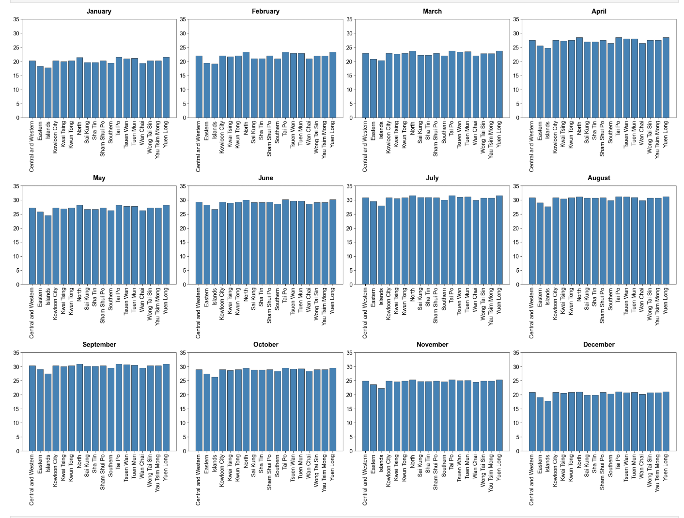
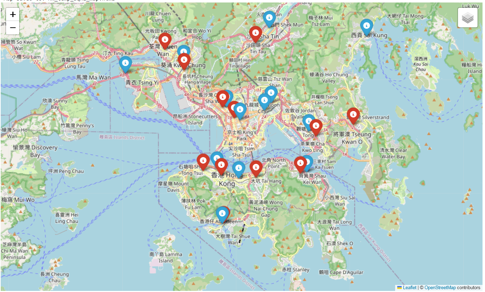

# Hong Kong Air Pollution & Temperature Analytics

A Python data analytics project that analyzes **temperature variation across 18 Hong Kong districts** and **air quality conditions across 18 AQHI monitoring stations** in 2024.

The project combines:
- weather data from the **Open-Meteo Archive API**
- monthly AQHI CSV files stored in the `aqi/` folder
- district and station reference data from `district.csv` and `station.csv`

The full workflow is implemented in a single **Jupyter Notebook**, covering data collection, preprocessing, analysis, visualization, and interactive mapping.

---

## Project Overview

This project explores spatial patterns in Hong Kong’s environmental conditions by comparing:

- **Monthly average daily maximum temperature** across 18 districts
- **Annual average daily maximum AQHI** across 18 monitoring stations

Using Python, the project automates data retrieval and cleaning, then presents the results through comparative charts and a Folium-based interactive map.

---

## Main Findings

- Inland districts such as **North, Yuen Long, and Tai Po** were generally warmer than coastal areas such as **Islands and Eastern**
- AQHI levels were relatively higher in dense urban areas such as **Mong Kok, Central, and Kwun Tong**
- The results suggest that both **geographical location** and **urban density** contribute to environmental differences across Hong Kong

---

## Tech Stack

- **Python**
- **Jupyter Notebook**
- **Pandas**
- **Requests**
- **Matplotlib**
- **Folium**
- **CSV / JSON**

---

## Project Structure

```text
.
├── hong-kong-air-quality-temperature-analysis.ipynb
├── README.md
├── district.csv
├── station.csv
├── aqi/
│   ├── ...
│   └── monthly AQHI CSV files
└── images/
    ├── result1.png
    └── result2.png
```

---

## Data Files

This repository contains the following input files:

- `district.csv` — district reference data used in temperature analysis
- `station.csv` — AQHI station reference data used in air quality analysis
- `aqi/` — monthly AQHI CSV files used to calculate annual air quality metrics

These files are required for the notebook to run correctly.

---

## Screenshots

### Monthly Temperature Comparison

Place your first result screenshot at:

```text
images/result1.png
```

After uploading the image file, it will display below:



### Interactive Hong Kong AQHI & Temperature Map

Place your second result screenshot at:

```text
images/result2.png
```

After uploading the image file, it will display below:



---

## How to Run

### 1. Clone this repository

```bash
git clone https://github.com/your-username/your-repository-name.git
cd your-repository-name
```

### 2. Install the required packages

```bash
pip install pandas requests matplotlib folium notebook
```

### 3. Check the file structure

Make sure the following files and folders are in the project directory:

- `district.csv`
- `station.csv`
- `aqi/` folder containing the monthly AQHI CSV files
- the notebook file

### 4. Open Jupyter Notebook

```bash
jupyter notebook
```

### 5. Run the notebook

Open the notebook and run the cells sequentially to reproduce:

- district-level temperature analysis
- AQHI preprocessing and aggregation
- monthly visualizations
- interactive map output

---

## Notes

- The project is implemented in **one Jupyter Notebook**
- AQHI analysis depends on the local CSV files inside the `aqi/` folder
- The Folium map is rendered inside the notebook environment
- If the screenshots are not uploaded yet, the image area in this README may appear blank or broken until the files are added

---


